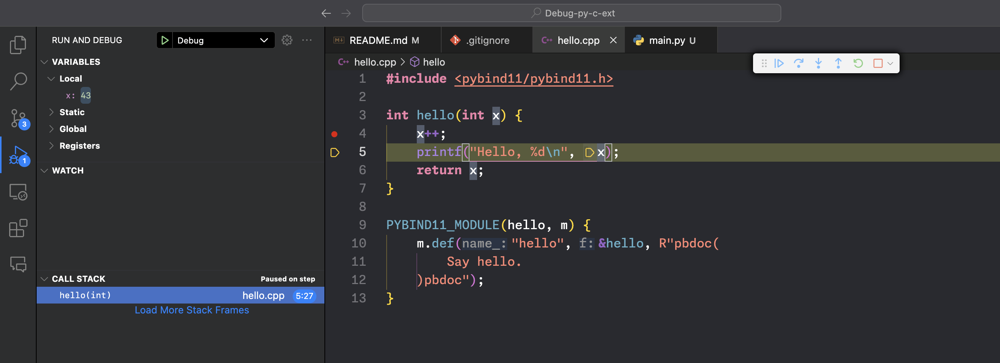

# Debug Python's C/C++ extensions

You can easily debug Python's C/C++ extensions using GDB/LLDB. Here's a demo.

You need to install [pybind11](https://github.com/pybind/pybind11) to build and run this project.

## How to build

```sh
mkdir build
cmake -S . -B build -DCMAKE_BUILD_TYPE=ON -DCMAKE_EXPORT_COMPILE_COMMANDS=ON
cmake --build build
```

This will build a `hello` extension module in `build/`, e.g. `build/hello.cpython-38-darwin.so` in macOS.

## How to run/debug

Write a simple Python script inside `build/` that loads the `hello` extension module and calls the `hello` function:

```python
# build/hello.py
from hello import hello

hello(42)
```

Set a breakpoint using VS Code GUI to `hello.cpp`'s `hello` function, and click
the Debug button of VS Code. You can check the debug config: [.vscode/launch.json](/.vscode/launch.json).



You can also use GDB/LLDB CLI to debug it:

```sh
cd build
lldb python hello.py
(lldb) b hello.cpp:hello
(lldb) r
```